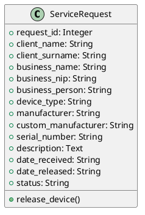

# Projekt Serwisowy

Aplikacja webowa do zarządzania zgłoszeniami serwisowymi dla serwisu komputerowego, zbudowana z użyciem Flask i SQLAlchemy.

## Plan działania
1. **Implementacja podstawowego CRUD**:
   - Dodawanie zgłoszeń (osoba prywatna/firma).
   - Wyświetlanie listy zgłoszeń.
   - Przeglądanie szczegółów zgłoszenia.
   - Oznaczanie zgłoszenia jako wydane.
2. **Dodatkowe funkcjonalności**:
   - Generowanie PDF dla zgłoszeń.
   - Filtrowanie listy zgłoszeń po statusie lub typie urządzenia.
3. **Dokumentacja**:
   - Generowanie dokumentacji z użyciem Sphinxa.
   - Diagram klas w UML.
4. **Pakowanie**:
   - Plik wykonywalny z PyInstallerem w GitHub Releases.

## Funkcjonalności
| Funkcjonalność | Status | PR |
|----------------|--------|----|
| Dodawanie zgłoszeń (osoba/firma) | Zaimplementowane | [#1](https://github.com/USER/Projekt-Serwisowy/pull/1) |
| Wyświetlanie listy zgłoszeń | Zaimplementowane | [#1](https://github.com/USER/Projekt-Serwisowy/pull/1) |
| Przeglądanie szczegółów | Zaimplementowane | [#2](https://github.com/USER/Projekt-Serwisowy/pull/2) |
| Oznaczanie jako wydane | Zaimplementowane | [#2](https://github.com/USER/Projekt-Serwisowy/pull/2) |
| Generowanie PDF | Zaimplementowane | [#3](https://github.com/USER/Projekt-Serwisowy/pull/3) |
| Filtrowanie listy zgłoszeń | Planowane | - |

## Sposób interakcji
- **GUI**: Aplikacja webowa dostępna w przeglądarce, z interfejsem opartym na Bootstrapie 5.3.0.
- Użytkownik może dodawać zgłoszenia, przeglądać listę, szczegóły, oznaczać zgłoszenia jako wydane i generować PDF.

## Wymagania
Zainstaluj wymagane biblioteki:
```bash
pip install -r requirements.txt
```

**requirements.txt**:
```
Flask==3.0.3
Flask-SQLAlchemy==3.1.1
pdfkit==1.0.0
```

Dodatkowo, zainstaluj wkhtmltopdf dla generowania PDF:
- Windows: Pobierz z [wkhtmltopdf.org](https://wkhtmltopdf.org/downloads.html) i dodaj do PATH.
- Linux: `sudo apt-get install wkhtmltopdf`

## Instalacja i uruchomienie
1. Sklonuj repozytorium:
   ```bash
   git clone https://github.com/USER/Projekt-Serwisowy.git
   cd Projekt-Serwisowy
   ```
2. Utwórz wirtualne środowisko i zainstaluj zależności:
   ```bash
   python -m venv .venv
   source .venv/bin/activate  # Linux/Mac
   .venv\Scripts\activate     # Windows
   pip install -r requirements.txt
   ```
3. Uruchom aplikację:
   ```bash
   python service_manager.py
   ```
4. Otwórz `http://127.0.0.1:5000` w przeglądarce.

## Dokumentacja
Dokumentacja wygenerowana za pomocą Sphinxa znajduje się w folderze `docs/`. Aby ją wygenerować:
```bash
cd docs
pip install sphinx sphinx-rtd-theme
make html
```
Otwórz `docs/_build/html/index.html` w przeglądarce.

## Diagram klas
Diagram UML dla modelu `ServiceRequest`:



## GitHub Releases
Plik wykonywalny (Windows) dostępny w [Releases](https://github.com/USER/Projekt-Serwisowy/releases).

## Podział na pliki
- `service_manager.py`: Główna aplikacja Flask.
- `models.py`: Model danych `ServiceRequest`.
- `templates/*.html`: Szablony HTML (`base.html`, `index.html`, `add.html`, `details.html`, `pdf_template.html`).
- `static/css/styl.css`: Style CSS.
- `docs/`: Dokumentacja Sphinxa.
- `requirements.txt`: Lista zależności.

## Licencja
MIT License